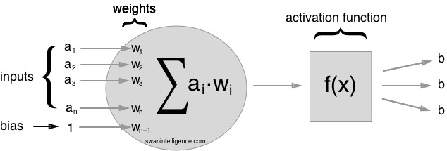

Title: Watch a single neuron learn
Date: 2016-02-22 20:00
Tags: Machine Learning, Neural Nets, Keras
Status: draft

The best way to learn an algorithm is to watch it in action. This is why I created the simplest
possible neural network in [Keras](http://keras.io). It's just a single neuron. We will train it
on the simplest non linear example.

I learned way more on this than I expected. So I will share it with you. This post will be as
visual as possible. No back prop calculation. Promised.

The data that we are going to predict is generated by a bilinear function that is `0` in the
interval `[0, 1]` and has the value `x-1` on the interval `[1, 2]`.



This is how a general neuron looks. In our case we will only have one input, the bias and one
output.

This is how we can create one neuron in Keras:



We had to take two choices here. One is the initialization of the weights. We chose
them to be randomly drawn from a normal distribution (... mean 0 and standard deviation 0.05).
The second choice is the activation function. The chosen
[ReLu](https://en.wikipedia.org/wiki/Rectifier_(neural_networks))
function looks similar to our data. It's `0` for `x<=0` and `x` for `x>0`. It actually performs
well in many real world applications.

