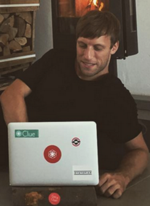

title: About

I'm the Count Count of menstrual cycles at [Clue](http://helloclue.com). I still need to get my work contract changed
on this.

By training I'm a Mathematician. I've worked in finance, as a programmer in a large software company and as a
business analyst in a startup.

Im interested in startup BI, machine learning, kaggle competitions and statistical fallacies.

When I'm not juggling numbers I like to hang out on electronic music festivals, go running, bouldering or hiking.

> Probability is not a mere computation of odds on the dice or more complicated variants; it is the acceptance of
> the lack of certainty in our knowledge and the development of methods for dealing with our ignorance.”

> ― Nassim Nicholas Taleb, Fooled by Randomness
